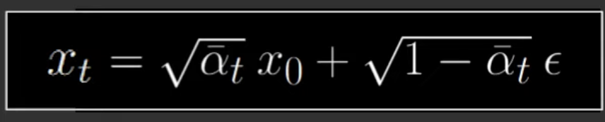

# MyDiffusionModel
This repo is a manual implementation of the basic version Diffusion Model in Pytorch.  
The main purpose of this work is to have a better understanding of the topic for myself. 

### How does the diffusion work?
1. Forward Process

<p align="center">
    
</p>

<p align="center">
    
</p>


```python
    def noise_images(self, x, t):
        """
        Forward Process
        
        Args:
            x (torch.float32): input images
            t (torch.int64): timestamp [batch_size,]

        Returns:
            noisy image: noisy image
            noise: The noise that is applied to each image [batch, 3, H, W]. This is the label to predict.
        """
        sqrt_alpha_hat = torch.sqrt(self.alpha_hat[t])[:, None, None, None]
        sqrt_one_minus_alpha_hat = torch.sqrt(1. - self.alpha_hat[t])[:, None, None, None]
        Ɛ = torch.rand_like(x)
        return sqrt_alpha_hat * x + sqrt_one_minus_alpha_hat * Ɛ, Ɛ
```

2. Reverse Process

```python
    def sample(self, model, n_image):
        logging.info(f"Sampling {n_image} new images ...")
        model.eval()
        with torch.no_grad():
            # import pdb;pdb.set_trace()
            x = torch.randn((n_image, 3, self.img_size, self.img_size)).to(self.device)
            for i in tqdm(reversed(range(1, self.noise_steps)), position=0):
                t = (torch.ones(n_image) * i).long().to(self.device)
                predicted_noise = model(x, t)
                alpha = self.alpha[t][:, None, None, None]
                alpha_hat = self.alpha_hat[t][:, None, None, None]
                beta = self.beta[t][:, None, None, None]
                if i > 1:
                    noise = torch.rand_like(x)
                else:
                    noise = torch.zeros_like(x)
                x = 1 / torch.sqrt(alpha) * (x - ((1 - alpha) / (torch.sqrt(1 - alpha_hat))) * predicted_noise) + torch.sqrt(beta) * noise
        model.train()
        x = (x.clamp(-1, 1) + 1) / 2
        x = (x * 255).type(torch.uint8)
        return x

```

3. Training Loop
<p align="center">
    
</p>

4. Sampling
<p align="center">
    
</p>

5. Model Architecture
<p align="center">
    
</p>

6. Self Attention Module
<p align="center">
    
</p>

7. Time Stamp Positional Encoding
<p align="center">
    
</p>

### Two Improvements added
8. Classifer Free Guidence (CFG)
<p align="center">
    
</p>

9. Exponential Moving Average (EMA)
<p align="center">
    
</p>


### How to run the package
0. Download the datasets
* [Cifar10x64](https://www.kaggle.com/datasets/joaopauloschuler/cifar10-64x64-resized-via-cai-super-resolution)
* [Landscape](https://www.kaggle.com/datasets/arnaud58/landscape-pictures)

1. Setup
```
export PYTHONPATH=$PYTHONPATH:/home/liqiang/Code/MyDiffusionModel
```

2. Training Unconditional DDPM  
```bash
export CUDA_VISIBLE_DEVICES=4;python ddpm.py
```

3. Training Conditional DDPM
```bash
export CUDA_VISIBLE_DEVICES=4;python ddpm_conditional.py
```

### Reference
1. https://www.youtube.com/watch?v=TBCRlnwJtZU
2. https://arxiv.org/pdf/1503.03585.pdf
3. https://arxiv.org/pdf/2006.11239.pdf